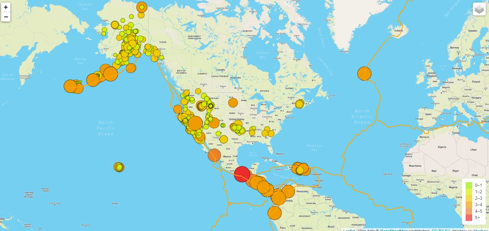

# Mapping_Earthquakes

## Mapping Earthquakes and Tectonic Plates

In this challenge I created an earthquake map which has an overlay of tectonic plate locations on the earth. There are layers that can be toggled on and off, and that show all the earthquakes, major earthquakes, and tectonic plates. There are also a number of mapbox map stylings you can choose from including satellite, streets, and dark. Data was taken from United States Geological Survey.

